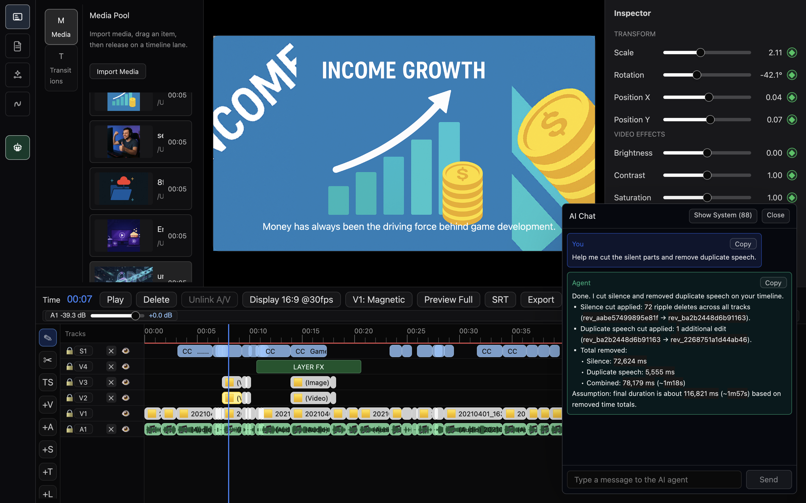
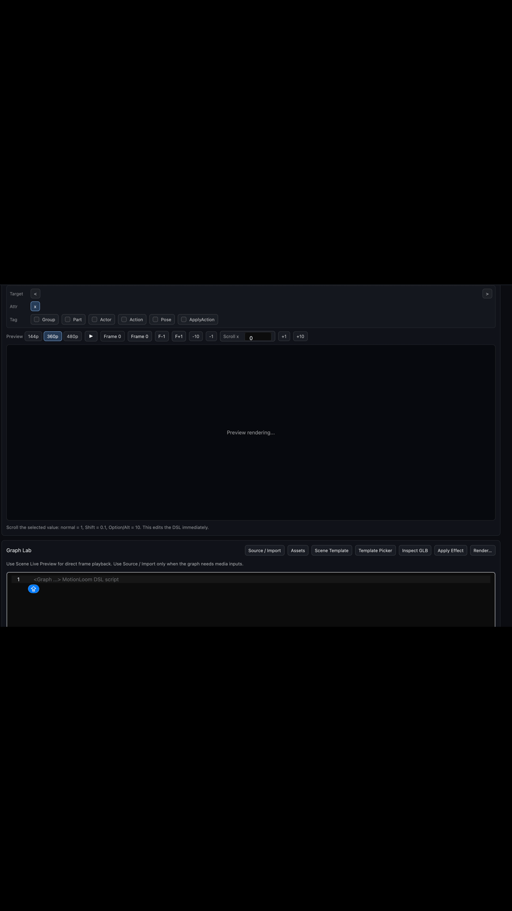

# Anica
<p align="center">
  
</p>


**An agentic-first video editor where AI is your collaborator, not just a tool.**

Built with Rust, WGPU, GPUI, FFmpeg for native GPU-accelerated workflows. Talk to your AI agent in natural language - it can inspect your timeline, suggest edits, and run ACP-powered (Agent Client Protocol) workflows from inside the editor.

> **Status:** Alpha - usable for early adopters. APIs, workflows, and project formats may change.

<p align="center">
  
</p>

---

## Why Anica?

Traditional video editors treat AI as an add-on. Anica treats it as part of the editing model.

Instead of jumping between timeline tools, subtitle utilities, and export dialogs, you can talk to an agent that understands the project state and helps drive the workflow.

| Traditional Editor | Anica |
|---|---|
| Manual timeline manipulation | Conversational editing via AI agents |
| Plugin-based AI features | Agent-native architecture |
| Separate analysis/export utilities | Timeline-aware ACP workflows |
| Effect menus and dialogs | Natural-language-assisted editing |

---

## Features

### Agent-Powered Editing

- **ACP Chat Inside the Editor** - Connect compatible agents and work from one conversation surface.
- **B-Roll Suggestions** - Agents analyze your timeline and suggest relevant B-roll or generated inserts.
- **Auto Silence Removal** - Detect and cut non-speaking segments to tighten pacing.
- **Semantic Speech Cleanup** - Identify low-confidence or duplicate spoken segments for cleaner edits.

### Subtitle and Language Pipeline

- **Local Whisper Model Packs** - Run subtitle generation with local ONNX Whisper packs.
- **Subtitle Translation** - Translate existing subtitles with LLM-backed workflows.
- **Timeline Re-import** - Bring translated subtitles back into the project with timing preserved.

<p align="center">
  
</p>

### Media Intelligence and Export

- **Smart Export Workflows** - Trigger export flows from the editor or through agent actions.
- **Project-Level Analysis** - Inspect clip lengths, media types, resolution distribution, and related metadata.
- **Native Preview + Runtime Tooling** - FFmpeg powers preview, export, proxies, thumbnails, and analysis.

---

## Example Agent Prompts

### Silence and Speech Cleanup

```text
Help me cut the silent parts.
Cut silent sections below -14 dB.
Help me cut the silent parts and remove duplicate speech.
```

### Subtitle Translation and Cleanup

```text
Help me translate the subtitles into English.
Please translate the S1 subtitle track into English.
Please translate the S1 subtitle track into Chinese, French, Japanese, Korean, and Italian, then place the translated tracks on S3, S4, S5, S6, and S7.
Remove repeated subtitle segments.
Remove silent gaps between subtitle segments and apply the edits directly.
Within any 30-second window, find repeated subtitles with similarity above 0.9. Remove the duplicate sentence segments, keep only the last occurrence, and apply the edits directly.
```

### B-Roll and Semantic Layer Workflows

```text
Suggest B-roll for this sequence.
Suggest B-roll and apply it to a semantic layer.
Suggest B-roll with <language> on-screen text.
```

## Motion Graphics and VFX

Anica includes MotionLoom, a GPU-powered motion graphics and VFX runtime for building animated visuals directly inside the editor.

MotionLoom supports timeline-aware compositing, animated text, overlays, transitions, and procedural effects. It is designed to work with Anica's agent system, allowing AI agents to generate or modify motion graphics from natural language prompts.

Example prompt:

```text
Create an 8-second cyber-style motion graphic using the MotionLoom DSL: black background, white text, typewriter-style reveal for the word "ANICA", with subtle floating movement and slow drifting motion in the air.
```

The prompt generates MotionLoom DSL code, which you can copy and paste on any compatible computer to reproduce the same motion graphics and VFX.

<table align="center">
  <tr>
    <td width="50%" align="center"></td>
    <td width="50%" align="center"></td>
  </tr>
</table>

MotionLoom provides the foundation for Anica's long-term goal of natural language to motion graphics and VFX.

---

## Platform Support

| Platform | Status |
|---|---|
| macOS (Apple Silicon / M-series) | Primary development target |
| Windows | Secondary development target |
| Linux | Untested / experimental |

---

## Tech Stack

| Layer | Technology |
|---|---|
| Language | Rust |
| UI Framework | GPUI |
| GPU Rendering | WGPU |
| Media Runtime | FFmpeg/FFprobe |
| Intelligence | ACP + LLM + generative image/video models |
| Speech / Subtitles | Local ONNX Whisper model packs |

---

## Getting Started

```bash
git clone https://github.com/LOVELYZOMBIEYHO/anica.git
cd anica
cargo run
```

or

```bash
cargo build --release --bins
```


### Build Requirements

- Rust `1.90.0` (pinned in [`rust-toolchain.toml`](rust-toolchain.toml))
- FFmpeg and FFprobe
- First `cargo run` attempts to bootstrap the local FFmpeg runtime if missing
- The bundled/runtime FFmpeg path does not require Homebrew
- macOS build host: Xcode command-line tools

### Quick Media Setup

On first run, Anica attempts to download the platform runtime listed in [`tools/media_tools_manifest.json`](tools/media_tools_manifest.json):

- macOS: Anica-maintained FFmpeg runtime
- Windows: BtbN FFmpeg LGPL shared runtime
- Linux: BtbN FFmpeg LGPL shared runtime

The setup scripts install both a versioned runtime and the active `current` runtime:

```text
tools/runtime/<os>/ffmpeg/<version>/
tools/runtime/current/<os>/ffmpeg/
```

Manual setup:

```bash
./scripts/setup_media_tools.sh
```

Windows manual setup:

```powershell
powershell -NoProfile -ExecutionPolicy Bypass -File scripts/setup_media_tools.ps1 -Yes
```

If the setup script fails, download the matching runtime archive from the GitHub release listed by the manifest:

```text
https://github.com/LOVELYZOMBIEYHO/anica/releases/tag/anica-runtime-20260610
```

Extract the archive at `tools/runtime/`. For example, the Windows archive should create:

```text
tools/runtime/windows/ffmpeg/8.1/
```

Then copy or sync that versioned runtime into:

```text
tools/runtime/current/windows/ffmpeg/
```

For more layout details, see [docs/MEDIA_RUNTIME_DROPIN.md](docs/MEDIA_RUNTIME_DROPIN.md).

### macOS Initial Setup

If this is your first time running Anica on macOS, install Xcode command-line tools and Rust first:

```bash
xcode-select -p >/dev/null 2>&1 || xcode-select --install
git clone https://github.com/LOVELYZOMBIEYHO/anica.git
cd anica
cargo run
```

If `cargo` is not installed yet, install Rust first with `rustup` as described in [docs/INSTALL.md](docs/INSTALL.md).

On macOS, `cargo run` attempts to bootstrap FFmpeg locally when needed.

### Runtime Notes

- Anica requires FFmpeg/FFprobe for preview, export, proxies, thumbnails, waveform preparation, and media analysis.
- The app prefers `tools/runtime/current/<os>/ffmpeg/bin/ffmpeg` and `ffprobe`.
- If `current` is missing but a versioned runtime exists, run the setup script with `--sync-only` on macOS/Linux or `-SyncOnly` on Windows.

### Fonts

Anica also scans local fonts from:

```text
assets/fonts/
```

Supported local font file types:

- `.otf`
- `.ttf`

These font files are treated as user-provided local assets and are not committed to the repository by default. Only add fonts that you have the right to use and redistribute.

Alpha notice: use at your own risk. Validate media, plugin, and third-party dependency compatibility in your own environment.

---

## Architecture

```text
+-------------------------------------------------------+
|                    GPUI Application                   |
+-------------------------------------------------------+
|                ACP Agents / Chat Layer                |
|              Codex | Gemini | Claude code             |
+-------------------------------------------------------+
|             Timeline + Project State Engine           |
+-------------------------------------------------------+
|     FFmpeg Preview | FFmpeg Export / Analysis      |
+-------------------------------------------------------+
|            WGPU / GPU Rendering and Effects           |
+-------------------------------------------------------+
```

---

## Project Structure

```text
src/
  core/       Timeline state, export, proxy, subtitle logic
  ui/         GPUI panels, interaction, rendering wiring
  api/        ACP request parsing, tool contracts, response shaping
  app/        Application bootstrap, window management

crates/
  video-engine/             FFmpeg playback and frame decoding
  gpui-video-renderer/      GPUI rendering bridge for video preview
  motionloom/               Compositing and world DSL runtime
  gpu-effect-export-engine/ GPU-effect export helpers
  ai-subtitle-engine/       Cloud/Local ONNX Whisper subtitle generation

docs/
  acp/                      Anica Control Protocol specification
  GPU_EFFECT_EXPORT_ENGINE.md
  rust_contributor_standard.md
```

---

## Goals

- Cross-platform support (macOS / Windows / Linux)
- WGPU-based effect rendering and GPU-assisted export pipeline
- Vibe editing, from agent-assisted to fully agent-driven workflows
- Video analysis and LLM-based scoring
- Storyboard generation from text
- Plugin and custom agent API
- Natural language to VFX effects

---

## Use Cases

- **YouTube creators** - Automate rough cuts, silence removal, and subtitle generation across languages.
- **Multilingual content teams** - Translate and re-subtitle projects faster.
- **Rapid prototyping** - Go from idea to rough edit through conversation and agent assistance.

---

## AI Subtitle Model Packs

Anica uses local ONNX Whisper model packs for offline subtitle generation. Place model packs under:

```text
crates/ai-subtitle-engine/src/model/onnx/<model_pack_folder>/
```

Each pack requires `manifest.json`, `config.json`, encoder/decoder ONNX files, and `tokenizer.json`. See [CONTRIBUTING.md](CONTRIBUTING.md) for the manifest expectations.

---

## Contributing

Contributions are welcome at every level:

- Report bugs or request features through the issue tracker of the repository host
- Submit pull requests
- Improve documentation
- Build custom agents or ACP workflows

Please read [CONTRIBUTING.md](CONTRIBUTING.md) before opening a PR.

---

## License

Apache License 2.0 - see [LICENSE](LICENSE).

Third-party notices: [docs/legal/THIRD_PARTY_NOTICES.md](docs/legal/THIRD_PARTY_NOTICES.md)

---

*"Real creativity starts when editing takes less of your time."*
